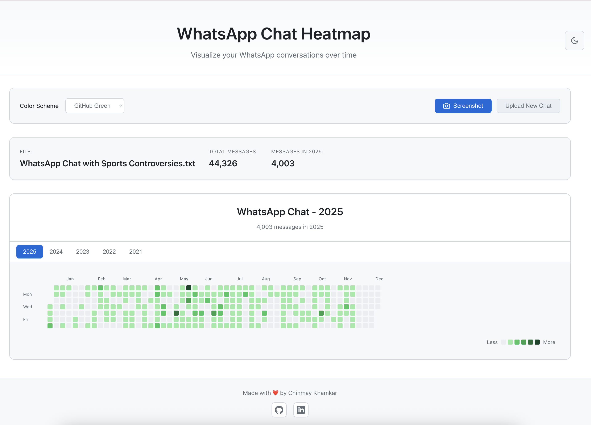

# WhatsApp Chat Heatmap

A beautiful, minimal, and privacy-focused web application that visualizes your WhatsApp chat activity as a GitHub-style contribution heatmap.



## Features

- 📊 **GitHub-Style Heatmap** - Beautiful visualization of your messaging patterns over time
- 🎨 **Multiple Color Schemes** - Choose from 6 different color themes (GitHub Green, Blue, Purple, Orange, Pink, Teal)
- 🔒 **100% Client-Side** - All processing happens in your browser. No data is sent to any server
- 📱 **Works with All Chats** - Supports both individual and group chat exports
- 🎯 **Minimal & Clean UI** - Simple, intuitive interface with dark mode design
- 📈 **Statistics** - View total messages and date ranges

## How to Use

1. **Export your WhatsApp chat:**
   - Open WhatsApp on your phone
   - Open the chat you want to visualize
   - Tap the three dots (⋮) menu → **More** → **Export chat**
   - Choose **Without Media**
   - Download the ZIP file, extract it, and keep the `.txt` file

2. **Upload the `.txt` file:**
   - Open the app
   - Click "Choose a file"
   - Select your exported chat file

3. **Visualize:**
   - View your messaging heatmap
   - Change color schemes
   - Hover over days to see message counts

## Development

```bash
# Install dependencies
npm install

# Run development server
npm run dev

# Build for production
npm run build

# Preview production build
npm run preview
```

## Tech Stack

- React 18
- TypeScript
- Vite
- Pure CSS (no frameworks)

## Privacy

This application is completely client-side. Your chat data:
- Never leaves your browser
- Is not uploaded to any server
- Is not stored anywhere
- Is processed entirely in your local environment

## License

MIT
